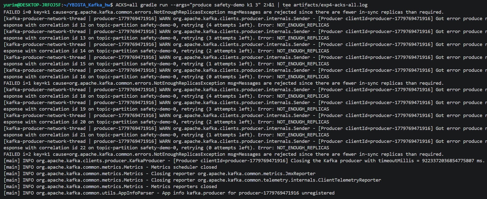

# Kafka Lab 실험 보고서

**이름**: 오유림
**소요 시간**: 26분
**`./judge.sh` 점수**: 12 / 14

## 실험 1. Topic, Partition, Key 해싱

**1-1.** `alice` 와 `bob` 의 파티션 번호.
* `alice`: **0번 파티션** (offset 0~4 적재 확인)
* `bob`: **0번 파티션** (offset 5~9 적재 확인)

**1-2.** 같은 key 가 항상 같은 파티션으로 가는 이유.
* Kafka의 프로듀서는 레코드에 Key가 지정되어 있을 경우, 기본적으로 `Murmur2` 해싱 알고리즘을 수행하여 고유한 해시 값을 생성합니다. 연산된 해시 값을 토픽의 총 파티션 수로 나머지 연산(`hash % numPartitions`)하여 데이터를 보낼 파티션을 결정하기 때문에, 파티션 개수가 유지되는 한 동일한 Key는 항상 동일한 파티션 번호로 매핑됩니다.
* 이번 실습의 경우, `alice`와 `bob` 문자열이 내부 해시 연산 및 Sticky Partitioner 등의 배치 메커니즘에 의해 우연히 동일하게 0번 파티션으로 묶여 할당되었습니다.

## 실험 2. Consumer Group 과 Rebalancing

**2-1.** 컨슈머 C1, C2, C3 (모두 `g1`) 이 받은 파티션.

| Consumer | 받은 partition |
|---|---|
| C1 (consumer-...06285) | `cg-demo-0` |
| C2 (consumer-...22343) | `cg-demo-1` |
| C3 (consumer-...24795) | `cg-demo-2` |

**2-2.** C1 을 죽였을 때 REBALANCE 가 어떻게 일어났는지 한 줄.
* `Group Coordinator`가 멤버의 이탈을 감지하여 `cooperative-sticky` 프로토콜 기반의 리밸런싱을 트리거하며, 죽은 컨슈머가 소유하고 있던 파티션의 소유권을 생존해 있는 다른 컨슈머에게 무중단으로 안전하게 재분배합니다。

## 실험 3. Replication, ISR, Leader Election

**3-1.** 브로커를 죽이기 **전** ISR 상태 (`artifacts/exp3-before.txt` 인용).
```text
Topic: failover-demo   Partition: 0   Leader: 2   Replicas: 2,3,1   Isr: 2,3,1
Topic: failover-demo   Partition: 1   Leader: 3   Replicas: 3,1,2   Isr: 3,1,2
Topic: failover-demo   Partition: 2   Leader: 1   Replicas: 1,2,3   Isr: 1,2,3
```


**3-2.** 죽인 **직후** ISR 상태 (`artifacts/exp3-after.txt` 인용). 어떤 컬럼이 바뀌었는지 한 줄.
```text
Topic: failover-demo   Partition: 0   Leader: 3   Replicas: 2,3,1   Isr: 3,1
Topic: failover-demo   Partition: 1   Leader: 3   Replicas: 3,1,2   Isr: 3,1
Topic: failover-demo   Partition: 2   Leader: 1   Replicas: 1,2,3   Isr: 1,3
```
* 바뀐 점: 2번 브로커가 다운되면서 Partition 0의 Leader가 2에서 3으로 자동 선출되었고, 모든 파티션의 Isr 컬럼에서 2가 빠지고 2개 브로커만 남도록 축소되었습니다.

**3-3.** Producer 가 메시지 40개를 손실 없이 보냈는지 (`exp3-producer.log` 의 마지막 offset 확인).
* 예(중간에 리더 브로커가 죽었음에도 무중단으로 Failover가 일어나 마지막 메시지까지 데이터 손실 없이 정상 전송 완료되었습니다.)

**3-4.** 손실이 없었다면 왜 그런지 두세 줄. `acks=all` + `min.insync.replicas` + `replication.factor=3` 의 보호 메커니즘 관점에서.
* replication.factor=3에 의해 데이터가 3대에 복제되고 있었고, ACKS=all 설정으로 인해 리더뿐만 아니라 ISR 내의 동기화된 팔로워까지 메시지 수신을 확인해야 커밋 처리됩니다. 따라서 리더인 2번 브로커가 순간적으로 죽더라도 이미 데이터가 동기화되어 있던 ISR 멤버(3번 브로커)가 즉시 새 리더로 승격되면서 데이터 유실 없이 지속적인 쓰기 작업이 보장됩니다.

## 실험 4. acks 와 min.insync.replicas

**4-1.** broker 2개를 죽인 상태에서 `acks=all` 시도 시 발생한 예외 클래스명과 메시지.
```text
org.apache.kafka.common.errors.NotEnoughReplicasException: Messages are rejected since there are fewer in-sync replicas than required.
```



**4-2.** `acks=1` 으로 바꿨을 때 성공했다면, ISR 정의 관점에서 왜 그런지 한 줄.
* acks=all은 min.insync.replicas=2 조건을 충족하지 못해 에러가 나지만, acks=1은 다른 복제본 상태와 무관하게 오직 살아있는 Leader 브로커 1대의 로컬 로그 적재만 확인하므로 전송이 성공합니다.

## 실험 5. Consumer Offset 과 auto.offset.reset

**5-1.** 같은 그룹으로 두 번째 consume 했을 때 받은 메시지 수와 그 이유.
* 받은 메시지 수: 0개
* 이유: 첫 번째 소비 시 컨슈머가 어디까지 읽었는지 나타내는 64비트 정수인 Consumer Offset이 10번까지 정상적으로 커밋되었기 때문에, 동일 그룹으로 재실행했을 때는 이미 커밋된 오프셋 이후부터 읽기를 시도하여 중복 수신이 발생하지 않습니다.

**5-2.** Consumer offset 이 저장되는 토픽 이름.
* __consumer_offsets

## 자유 회고 (선택)
* 실험 3(Leader Election)과 실험 4(acks 트레이드오프) 실험이 가장 인상 깊었습니다. 이론으로만 접했던 분산 가용성 메커니즘인 ISR 축소와 새 리더 선출 과정을 실시간 로그 데이터로 직접 검증하고, 인프라 장애 속에서 데이터 내구성과 서비스 가용성 간의 트레이드오프가 어떻게 발현되는지 눈으로 확인해 볼 수 있어 뜻깊은 실습이었습니다.
